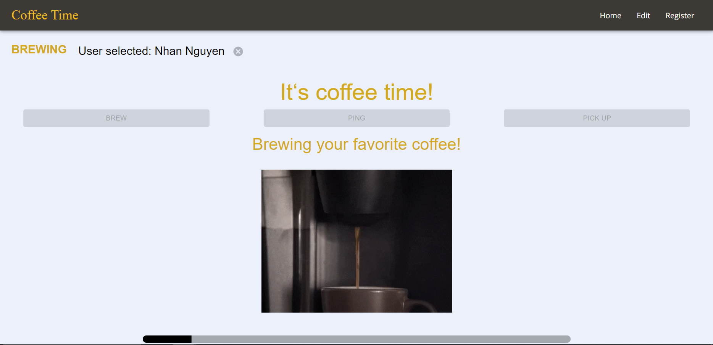

# Coffee Time



## About The Project

This project is a full stack web application that simulates the process of a coffee machine where a user can use to register and get their coffee brewed as well as notify them when their coffee is ready.

This project was created with:
- Typescript
- React v18.2.0
- Node v20.8.10
- Next v14.0.1
- Material UI v5.14.16
- MongoDB Atlas

## Installation

To run the project, follow these steps:

1. Clone the repository
```
git clone https://github.com/nhanaa/coffee-time.git
```
2. Build the project
```
npm run dev
```
Open [http://localhost:3000](http://localhost:3000) with your browser to use the application.

## How To Use

### Registration

To use this application, the users must first do a one time registration with their name and email:
1. Navigate to register tab with `register` on the navigation bar. The user can then register with the form.
2. Click on register to finish registering. Make sure that your email has not been used.

### Brewing

Once user has registered, they can start their brew:
1. On the home page, click on brew button to start the machine and select your name.
2. Then the start brew will appear. The user can now start the brewing process by clicking that button. The brewing process would take from 50s-1min.
3. After the process is done, the coffee of that user can be pinged by another person to notify the user their coffee is done, or be picked up by the user.

### Pinging

When a user's coffee is done and the user is not there to pick it up, another user can ping to notify that user their coffee is done:
1. On the home page, click on the ping button to open the list of brewed coffee.
2. Click on the ping button on the row correspond to the user you want to notify and an email will be sent to their email notifying that their coffee is ready.

### Picking up coffee

When your coffee is ready you can pick up your coffee and mark it on the machine so that it is ready for a next brew:
1. On the home page, click on the pick up button to open the list of brewed coffee:
2. Click on the pick up button on the row correspond to your coffee and your coffee will be marked as picked and be available for a next brew.

### Cautions

Do not navigate out of the page when a user is selected or the brewing session is going on.

## Inferred Features Implemented
Below are some of the features implemented that were not required:
- Email notification system: I implemented an email notification system with a library called `nodemailler` and a Gmail that I created.
